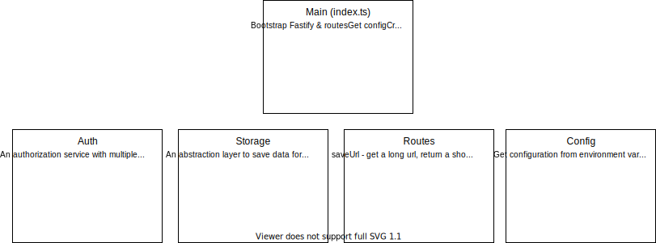

# Contribution

Ready to contribute? Great!

This is the place to get all the necessary information to help you doing that.

## Getting started

See [running the project in development mode](#running-the-project-in-development-mode).

The best way to get started is to join our [Slack](https://join.slack.com/t/mini-services/shared_invite/zt-kkr2n6nl-AlboXMQO~~atqUM2Wd0oPg) or browse the existing [issues](https://github.com/mini-services/miniurl/issues/new/choose) (issues tagged as `good first issue` are highly recommended) and just pick something to work on. Open a pull request when you're done and we'll review it ASAP.

## Running the project in development mode
```s
git clone https://github.com/mini-services/miniurl.git
cd miniurl
npm install
npm run dev
```
## I need help. What do I do?
Don't get lost trying to submit a perfect PR or getting familiar with the entire codebase before starting. Pick a task and start with it. Struggling to finish the task? Just submit the PR with a `WIP` tag and a team member will review it and help you find your way. You may also contact us on [Slack](https://join.slack.com/t/mini-services/shared_invite/zt-kkr2n6nl-AlboXMQO~~atqUM2Wd0oPg) for a faster response.
## Boards

The MiniUrl team maintains boards for tracking the Roadmap and releases. You can find them [here](https://github.com/mini-services/miniurl/projects).

## Troubleshooting

### I'm deploying a Postgres database via helm and after uninstalling and reinstalling it, I can't connect.
This is probably due to Helm not deleting the PersistentVolumeClaims of the database, so that the data won't accidentaly be deleted along with the helm chart release.

-   Uninstall the helm chart
-   Delete the pvc: `kubectl delete pvc data-<RELEASE_NAME>-postgresql-0` (release_name is usually miniurl)
-   Reinstall the helm chart

## Common issues

### How do I create a new migration in the Storage Relational driver?
-   cd to src/services/storage/drivers/relational folder
-   run `npx knex migrate:make <MIGRATION_NAME> -x ts --migrations-directory migrations`

### My urls keep getting erased on development mode!
That's OK. The development mode uses the InMemory storage driver, which means that it saves everything inside a simple JS object. On every server restart, that project will be erased and the data will be lost.

If you want to persist the data, you can edit the .env.development file and change the storage driver.

### How can I run a local postgres database for development purposes?
-   Make sure you have Docker installed
-   Run `docker run -d --name postgres -e POSTGRES_PASSWORD=postgres -p 5432:5432 postgres`
-   On .env.development, comment the InMemory Storage section and uncomment the Relational Storage section
## Project structure


